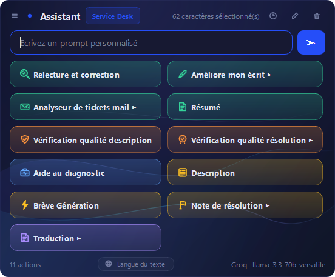
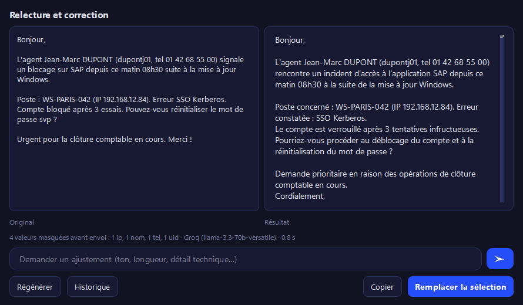

# ScribeDesk

**Français** · [English](docs/README.en.md) · [Español](docs/README.es.md)

**Assistant d'écriture système pour Service Desk — qui n'envoie jamais les données de vos usagers.**

Sélectionnez du texte n'importe où, appuyez sur `Ctrl+Espace`, choisissez une action.
Ou `Ctrl+Alt+Espace` : la correction remplace votre sélection, sans rien afficher.

La différence avec les autres assistants de rédaction tient en une ligne :
**les données personnelles sont remplacées par des jetons avant l'appel au modèle,
et les valeurs réelles sont réinjectées dans la réponse.** Le fournisseur cloud ne
voit jamais le nom de l'usager ; vous récupérez un texte complet et directement
utilisable.

<p align="center">
  
</p>

---

## Le problème

Un agent de Service Desk écrit toute la journée des notes qui contiennent des
données à caractère personnel : noms, numéros de téléphone, adresses, identifiants
de connexion, adresses IP. Lui donner un assistant branché sur une API américaine, c'est
exporter ces données hors de l'Union européenne à chaque correction de faute
d'orthographe ou mise en forme de ticket.

Les deux réponses habituelles sont insatisfaisantes : interdire l'outil — l'agent
continue d'écrire mal, ou utilise ChatGPT dans son navigateur sans aucun
garde-fou — ou tout héberger en local, coûteux et souvent hors de portée d'un
service informatique.

ScribeDesk propose une troisième voie : **l'anonymisation réversible en mémoire vive**.

### Exemple concret d'un problème rédigé

Voici une note brute typique rédigée à la volée par un technicien support lors d'un appel :

```text
Bonjour,

L'agent Jean-Marc DUPONT (dupontj01, tel 01 42 68 55 00) signale un blocage sur SAP depuis ce matin 08h30 suite à la mise à jour Windows.

Poste : WS-PARIS-042 (IP 192.168.12.84). Erreur SSO Kerberos. Compte bloqué après 3 essais. Pouvez-vous réinitialiser le mot de passe svp ?

Urgent pour la clôture comptable en cours. Merci !
```

## Comment ça marche

<p align="center">
  
</p>

1. **Substitution locale (Zero-Leak) :** Avant tout départ vers le réseau, ScribeDesk détecte et remplace les données identifiantes par des jetons temporaires conservés uniquement en RAM :
   ```text
   Bonjour,

   L'agent [[NOM_1]] ([[UID_1]], tel [[TEL_1]]) signale un blocage sur SAP depuis ce matin 08h30 suite à la mise à jour Windows.

   Poste : WS-PARIS-042 (IP [[IP_1]]). Erreur SSO Kerberos. Compte bloqué après 3 essais. Pouvez-vous réinitialiser le mot de passe svp ?

   Urgent pour la clôture comptable en cours. Merci !
   ```
2. **Traitement par le modèle :** Le fournisseur cloud reçoit une phrase grammaticalement complète et cohérente — il peut donc la comprendre, la corriger ou la restructurer — mais vidée de toute donnée personnelle. `SAP` ou `SSO Kerberos` restent visibles : ce sont des termes techniques essentiels pour le modèle.
3. **Restauration transparente :** Dès réception de la réponse, les jetons `[[...]]` sont réassociés à leurs valeurs d'origine. L'agent récupère immédiatement le texte final prêt à l'emploi.

## Essayer en trente secondes

Aucune clé d'API, aucun compte, aucune connexion réseau :

```bash
git clone https://github.com/Geniiius/scribedesk
cd scribedesk
pip install -e .

scribedesk redact --mapping -t "Bonjour, l'agent DUPONT (dupontj01) au 02 000 00 00
signale que M. Martin ne sait plus ouvrir SAP. Mail : jean.martin@exemple.test"
```

```
— 5 valeur(s) masquée(s) : 1 × EMAIL, 2 × NOM, 1 × TEL, 1 × UID
    [[NOM_1]] = DUPONT
    [[UID_1]] = dupontj01
    [[TEL_1]] = 02 000 00 00
    [[NOM_2]] = Martin
    [[EMAIL_1]] = jean.martin@exemple.test
Bonjour, l'agent [[NOM_1]] ([[UID_1]]) au [[TEL_1]]
signale que M. [[NOM_2]] ne sait plus ouvrir SAP. Mail : [[EMAIL_1]]
```

Le compte rendu et la table de correspondance partent sur la sortie d'erreur,
le texte anonymisé sur la sortie standard : `scribedesk redact -t "…" | …`
ne transmet que le texte, jamais les valeurs réelles.

## Installation

### Windows — exécutable autonome

[**Télécharger la dernière version**](https://github.com/Geniiius/scribedesk/releases/latest)
— un seul fichier `ScribeDesk.exe`, qui n'exige ni Python ni installation.
Placez-le où vous voulez et lancez-le : une icône apparaît dans la zone de
notification.

L'exécutable est construit par l'intégration continue à partir du code de ce
dépôt, et publié avec son empreinte SHA-256. Pour vérifier le fichier
téléchargé, comparez-la :

```powershell
Get-FileHash ScribeDesk.exe -Algorithm SHA256
```

N'étant signé par aucun certificat, il déclenche l'avertissement SmartScreen au
premier lancement — « Informations complémentaires », puis « Exécuter quand
même ».

L'exécutable n'embarque **aucun modèle** : il reste à en désigner un, en local
avec [Ollama](https://ollama.com) ou en ligne avec une clé d'API (voir le
tableau des fournisseurs ci-dessous). Les préférences et la clé se rangent dans
le profil de l'utilisateur et le trousseau du système, jamais dans le fichier :
une mise à jour se fait en remplaçant l'exécutable, sans rien reconfigurer.

### Depuis les sources — Windows, Linux

ScribeDesk n'est pas encore publié sur PyPI. L'installation se fait depuis les
sources, et réclame **Python 3.11 ou plus récent**.

```bash
git clone https://github.com/Geniiius/scribedesk
cd scribedesk

# Bibliothèque et ligne de commande seules (aucune dépendance Qt)
pip install -e .

# Avec l'interface graphique et les raccourcis globaux
pip install -e ".[gui]"

python -m scribedesk
```

Testé sous **Windows 11** et **Linux**. macOS n'est pas pris en charge : les
permissions d'accessibilité et la signature du binaire demandent un travail
spécifique qui n'a pas été fait.

Une icône apparaît dans la zone de notification. **Au premier lancement,
ScribeDesk vérifie que le moteur configuré répond** et ouvre les préférences si
une clé manque : vous ne découvrirez pas le problème au moment de corriger un
ticket.

Par défaut, l'outil vise **Ollama en local** — rien ne sort du poste, et
l'anonymisation devient superflue. Pour un usage en ligne, choisissez un
fournisseur dans Préférences → Modèle. La clé est rangée dans le trousseau du
système, jamais dans un fichier.

| Fournisseur | Particularité |
|---|---|
| **Ollama** | Local, aucune donnée ne sort, aucune clé |
| **NVIDIA NIM** | Crédits gratuits, large choix de modèles |
| **Groq** | Très rapide, palier gratuit généreux |
| **Mistral** | Hébergement européen |
| **OpenAI** | — |
| *Personnalisé* | Tout point d'accès compatible OpenAI |

## La langue de l'assistant

L'interface et les onze actions livrées sont en français. Les **réponses**, en
revanche, ne le sont pas nécessairement : Préférences → Langue de l'assistant
propose `Automatique`, `Français`, `English` et `Español`.

`Automatique` — le défaut — laisse le texte décider : un ticket anglais revient
corrigé en anglais. Une langue explicite s'impose à la place, quelle que soit
celle du ticket : c'est le réglage d'une équipe qui reçoit des demandes en
français mais documente en anglais.

L'ordre de priorité est le suivant, du plus ponctuel au plus général :

1. la langue choisie **dans la palette**, pour cet envoi seulement ;
2. la **langue de l'assistant**, fixée dans les préférences ;
3. la langue **détectée** dans le texte sélectionné (français, anglais,
   espagnol) ;
4. à défaut, le choix est laissé au modèle, qui voit le texte.

Ce classement place le ponctuel avant le permanent : répondre une seule fois en
espagnol ne doit pas obliger à ouvrir les préférences, puis à penser à les
remettre.

## Les deux raccourcis

| Raccourci | Effet |
|---|---|
| `Ctrl+Espace` | Ouvre la palette : 11 actions, consigne libre, historique, éditeur |
| `Ctrl+Alt+Espace` | Applique l'action par défaut et remplace la sélection en un clic |

<p align="center">
  
  &nbsp;
  
</p>

Le second raccourci existe parce qu'un relevé d'usage réel montrait que **9 appels sur 10**
portaient sur la même action, sur des textes de 80 caractères en médiane. Passer
par la palette puis par une fenêtre de résultat pour corriger un accent coûtait
six gestes ; celui-ci en coûte un. Une pastille éphémère signale la progression.

## Les boutons d'action du Service Desk

La palette propose **11 actions spécialisées** conçues pour couvrir l'intégralité du cycle de vie d'un ticket :

### 1. Qualification & Description du ticket

| Action | Rôle métier | Transformation apportée |
|---|---|---|
| **Description** | Structuration ITIL | Transforme des notes brutes en fiche d'incident normée (*Description*, *Tests effectués*, *Informations utiles*, *Coordonnées*). |
| **Relecture et correction** | Nettoyage express | Corrige l'orthographe, les accords et la ponctuation sans altérer le style ni le vocabulaire technique. |
| **Améliore mon écrit ▸** | Posture & Clarté | Reformule le message en adaptant le ton (*Formel*, *Neutre*, *Empathique*, *Direct*) selon l'interlocuteur. |
| **Brève Génération** | Titrage normé | Rédige un titre percutant (60 à 100 caractères) adapté au champ *Objet* ou *Titre court* de l'outil de billetterie. |
| **Analyseur de tickets mail ▸** | Dépouillement e-mail | Analyse un courriel utilisateur complexe pour en extraire le problème, l'urgence et les actions immédiates recommandées. |

### 2. Diagnostic & Résolution technique

| Action | Rôle métier | Transformation apportée |
|---|---|---|
| **Aide au diagnostic** | Analyse d'incident | Identifie la cause probable à partir des messages d'erreur et symptômes, puis suggère des étapes de résolution ordonnées. |
| **Note de résolution ▸** | Clôture de ticket | Rédige une note de clôture soignée destinée à l'usager ou à la base de connaissances (cause racine, action corrective, conseils préventifs). |
| **Résumé** | Synthèse de dossier | Résume l'historique d'un ticket à rallonge pour faciliter les escalades ou les changements d'équipe. |

### 3. Contrôle qualité & International

| Action | Rôle métier | Transformation apportée |
|---|---|---|
| **Vérification qualité description** | Audit de complétude | Contrôle que le ticket contient tous les éléments indispensables (contexte, erreur, impact) et suggère des ajouts. |
| **Vérification qualité résolution ▸** | Audit de clôture | Valide que la solution documentée est claire, reproductible et directement compréhensible par le destinataire. |
| **Traduction ▸** | Support multilingue | Traduit fidèlement dans la langue cible (*anglais, espagnol, etc.*) en respectant les termes techniques et le registre choisi. |

---

### Résultat obtenu avec le bouton « Description »

Appliqué à l'exemple de problème rédigé plus haut, le bouton **Description** produit automatiquement ce découpage structuré, prêt à être copié dans votre outil de billetterie (*ServiceNow, Jira, EasyVista, Zendesk*) :

```markdown
**Description**
L'agent signale un blocage d'accès à l'application SAP survenu à 08h30 à la suite de la mise à jour Windows. Le compte utilisateur est verrouillé après 3 tentatives infructueuses liées à une défaillance de l'authentification SSO Kerberos.

**Tests effectués**
- 3 tentatives de connexion effectuées (ayant entraîné le verrouillage du compte).

**Informations utiles**
- Contexte : Incident survenu suite à la mise à jour Windows à 08h30.
- Application concernée : SAP.
- Environnement / Poste : WS-PARIS-042 (IP 192.168.12.84).
- Message d'erreur : Erreur SSO Kerberos.
- Impact : Blocage urgent en pleine période de clôture comptable.

**Coordonnées de contact**
- Jean-Marc DUPONT (identifiant : dupontj01).
- Téléphone : 01 42 68 55 00.
```

## Ce que fait la détection

| Règle | Contenu | Fiabilité |
|---|---|---|
| `EMAIL` | Adresses de courrier | Élevée |
| `IBAN` | Comptes bancaires | Élevée — clé mod 97 vérifiée |
| `NRN` | Registre national belge | Élevée — clé de contrôle vérifiée |
| `NIR` | Sécurité sociale française | Élevée — clé de contrôle vérifiée |
| `CB` | Cartes bancaires | Élevée — algorithme de Luhn |
| `TEL` | Téléphones BE / FR / LU | Élevée |
| `IP`, `MAC` | Adresses réseau | Élevée |
| `URL` | Liens, souvent porteurs de jetons | Élevée |
| `LOGIN` | `DOMAINE\utilisateur` | Élevée |
| `UID` | Identifiants type `dupontj01` | Moyenne — heuristique |
| `NOM` | Patronymes | **Moyenne — heuristique** |

Les règles à clé de contrôle ne produisent quasiment pas de faux positifs : un
nombre à onze chiffres n'est un registre national que si sa clé tombe juste.

La détection des **patronymes** est différente, et il faut le dire clairement :
elle repose sur des heuristiques — mot en capitales, mot suivant une civilité —
filtrées par une liste de 200 sigles métier et mots français courants. Elle
attrape `DUPONT` et `M. Martin`, laisse passer `SAP`, `RGPD` et `BONJOUR` — mais
**elle ne remplace pas une relecture humaine**. Un nom écrit en minuscules au fil
d'une phrase lui échappe.

Deux réglages permettent d'ajuster :

- **Sigles maison** (Préférences → Confidentialité) : ajoutez `GEODE`, `ATLAS`…
  pour que vos applications internes ne soient jamais prises pour des personnes.
- **Confirmation avant envoi** : affiche exactement ce qui va partir, et attend
  votre accord. Coûteux au quotidien, précieux en phase de mise en confiance —
  ou pour une démonstration.

## Écrire ses propres actions

Depuis la palette, le bouton d'édition permet de créer, modifier, importer et
exporter des actions sans quitter l'application.

Sous le capot, chacune est un fichier Markdown avec un en-tête TOML :

```markdown
+++
name = "Note de clôture"
group = "Service Desk"
icon = "resolution"
color = "green"
prefix = "Rédige la note de clôture de ce ticket :\n\n"

[[parameters]]
name = "ton"
label = "Ton"
choices = ["Formel", "Neutre"]
+++

Tu es un assistant de rédaction pour un Service Desk francophone…
```

Une action personnelle portant le nom d'une action fournie la remplace : vous
pouvez adapter une invite sans perdre les mises à jour des autres.

## Architecture

```
src/scribedesk/
├── config.py         Préférences TOML  ·  clés d'API dans le trousseau système
├── engine.py         Orchestration : action → anonymisation → modèle → restauration
├── history.py        Journal JSONL, métadonnées seules par défaut
├── cli.py            Ligne de commande
├── privacy/          Détection et substitution réversible
├── prompts/          Bibliothèque d'actions (Markdown + en-tête TOML)
├── providers/        Ollama, NVIDIA, Groq, Mistral, OpenAI, compatible
└── ui/               Qt — chargé seulement si une fenêtre doit s'afficher
```

Deux principes structurent le découpage :

1. **Le cœur ne connaît pas Qt.** `import scribedesk` ne charge ni PySide6 ni
   `httpx`. La logique se teste sans serveur graphique, et la bibliothèque est
   réutilisable dans un script.
2. **Un seul chemin d'exécution.** Interface et ligne de commande passent toutes
   deux par `Engine`. Il n'existe pas de code d'anonymisation « pour la CLI »
   qui pourrait diverger de celui de l'interface.

**Zéro actif binaire.** Aucun PNG ni police embarquée : le dégradé de fond et
les pictogrammes sont peints dynamiquement en vectoriel.

## Développement

```bash
git clone https://github.com/Geniiius/scribedesk
cd scribedesk
pip install -e ".[gui,dev]"

pytest
ruff check src tests
mypy src               # mode strict
```

Sous Linux, exportez `QT_QPA_PLATFORM=offscreen` si Qt réclame un affichage.

Les tests couvrent en priorité ce qui casse en silence : un jeton coupé en deux
par le découpage réseau, une réponse arrivant avant que l'appelant n'ait branché
ses signaux, un fichier de préférences corrompu, une palette qui cesse de se
fermer, un `paintEvent` fautif.

`tests/test_imports.py` verrouille le découpage en couches : il échoue si un
module du cœur se met à importer Qt ou `httpx`. Sans lui, la séparation ne
tiendrait qu'à la discipline.

### Variables d'environnement

Aucune n'est nécessaire à l'usage courant : la configuration passe par
l'interface, et les clés d'API par le trousseau du système. **ScribeDesk ne lit
aucun fichier `.env`** — déposer un secret en clair dans un dossier de projet
est précisément ce que ce programme cherche à éviter.

| Variable | Rôle |
|---|---|
| `SCRIBEDESK_API_KEY` | Clé d'API en lecture seule, prioritaire sur le trousseau. Pour un conteneur, une intégration continue, ou un poste sans coffre-fort système. |
| `SCRIBEDESK_HOME` | Force un répertoire unique pour la configuration, l'historique et les actions. Utilisé par les tests, et pratique pour une installation portable. |
| `QT_QPA_PLATFORM` | Variable Qt. `offscreen` fait tourner les tests d'interface sans écran. |

### Construire l'exécutable Windows

```bash
pip install pyinstaller
pyinstaller --noconfirm ScribeDesk.spec
```

Le résultat est `dist/ScribeDesk.exe`. La recette est lisible dans
[`ScribeDesk.spec`](ScribeDesk.spec) ; en pratique, la construction est faite
par l'intégration continue à chaque tag `v*` — voir
[`.github/workflows/release.yml`](.github/workflows/release.yml).

## Limites connues

- La détection de patronymes est heuristique (voir plus haut).
- La capture de la sélection simule `Ctrl+C`. Une application qui bloque ce
  raccourci ne fournira rien.
- macOS n'est pas pris en charge : permissions d'accessibilité et signature du
  binaire demandent un travail spécifique.
- Un raccourci global peut être refusé s'il est déjà pris. ScribeDesk le
  journalise et reste utilisable depuis la zone de notification.

## Sécurité

Une donnée personnelle qui franchit la frontière réseau alors qu'une règle
aurait dû la masquer est une vulnérabilité, et se signale en privé — pas dans
une issue publique. [`SECURITY.md`](SECURITY.md) trace la limite entre ce qui
relève du défaut et ce qui relève de l'heuristique documentée ci-dessus, et
indique la marche à suivre.

## Licence

Distribué sous licence **MIT**. Voir [`LICENSE`](LICENSE).
