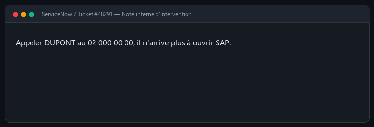
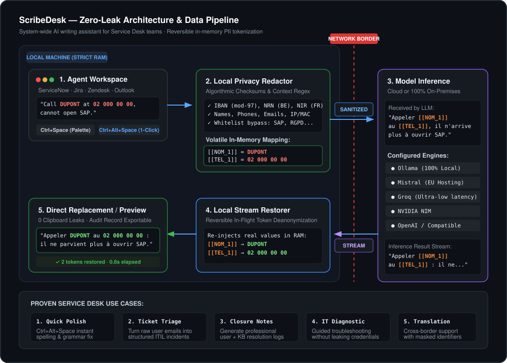

# ScribeDesk

[Français](../README.md) · **English** · [Español](README.es.md)

**A desktop writing assistant for IT Service Desks — one that never sends your users' data.**

Select text anywhere, press `Ctrl+Space`, pick an action. Or press
`Ctrl+Alt+Space`: the correction replaces your selection, with nothing shown on
screen.

What sets it apart fits in one sentence: **personal data is replaced with
tokens before the model is called, and the real values are put back into the
answer.** The cloud provider never sees the user's name; you get back complete,
ready-to-paste text.

<p align="center">
  
</p>

## The problem

A Service Desk agent writes notes all day long, and those notes are full of
personal data: names, phone numbers, addresses, login IDs. Handing that agent an
assistant wired to a US API means exporting those data outside the European
Union every time someone fixes a typo.

The two usual answers are both unsatisfying: ban the tool — and the agent keeps
writing badly, or opens ChatGPT in a browser tab with no safeguard at all — or
host everything locally, which is expensive and often out of reach for a small
department.

ScribeDesk offers a third way.

## How it works

<p align="center">
  
</p>

The provider receives a grammatically complete sentence — so it can correct it
properly — but stripped of anything identifying. `SAP` stays visible: it is an
application name, not personal data, and the model needs it to understand the
context.

## Try it in thirty seconds

No API key, no account, no network connection:

```bash
git clone https://github.com/Geniiius/scribedesk
cd scribedesk
pip install -e .

scribedesk redact --mapping -t "Call DUPONT on 02 000 00 00, he cannot open SAP anymore.
Mail: jean.martin@example.test"
```

The anonymised text goes to standard output and the mapping table to standard
error, so `scribedesk redact -t "…" | …` only ever pipes the text, never the
real values.

## Installation

### Windows — standalone executable

[**Download the latest release**](https://github.com/Geniiius/scribedesk/releases/latest)
— a single `ScribeDesk.exe` file, with no Python and no installation required.
Put it wherever you like and run it: an icon appears in the notification area.

The executable is built by continuous integration from the code in this
repository and published with its SHA-256 checksum. To verify your download:

```powershell
Get-FileHash ScribeDesk.exe -Algorithm SHA256
```

It carries no code-signing certificate, so Windows SmartScreen warns on first
launch — "More info", then "Run anyway".

### From source — Windows, Linux

Requires **Python 3.11 or newer**. Not on PyPI yet.

```bash
git clone https://github.com/Geniiius/scribedesk
cd scribedesk

pip install -e .          # library and CLI only, no Qt dependency
pip install -e ".[gui]"   # with the graphical interface and global hotkeys

python -m scribedesk
```

Tested on **Windows 11** and **Linux**. macOS is not supported: accessibility
permissions and binary signing require specific work that has not been done.

## Choosing a model

ScribeDesk ships no model. By default it targets **Ollama running locally** —
nothing leaves the machine, and anonymisation becomes redundant. For online use,
pick a provider under Preferences → Model. The key is stored in the operating
system keychain, never in a file.

| Provider | Notable for |
|---|---|
| **Ollama** | Local, no data leaves the machine, no key |
| **NVIDIA NIM** | Free credits, wide model choice |
| **Groq** | Very fast, generous free tier |
| **Mistral** | European hosting |
| **OpenAI** | — |
| *Custom* | Any OpenAI-compatible endpoint |

## Language

**The interface and the eleven built-in actions are written in French.** The
assistant's *answers*, however, are not tied to it: under
Preferences → Assistant language, choose `Automatic` (follow the language of the
selected text), `Français`, `English` or `Español`. A language picked in the
palette overrides that setting for a single run.

Source-language detection covers French, English and Spanish.

## The two shortcuts

| Shortcut | Effect |
|---|---|
| `Ctrl+Space` | Opens the palette: 10 actions, free-form instruction, history, editor |
| `Ctrl+Alt+Space` | Applies the default action and replaces the selection |

The second one exists because real usage data showed that **9 calls out of 10**
used the same action, on texts of 80 characters in median length. Going through
the palette and then a result window to fix an accent cost six gestures; this
one costs a single gesture.

## What the detection covers

| Rule | Content | Reliability |
|---|---|---|
| `EMAIL` | Email addresses | High |
| `IBAN` | Bank accounts | High — mod 97 checksum verified |
| `NRN` | Belgian national register | High — check digit verified |
| `NIR` | French social security | High — check digit verified |
| `CB` | Payment cards | High — Luhn algorithm |
| `TEL` | Phone numbers BE / FR / LU | High |
| `IP`, `MAC` | Network addresses | High |
| `URL` | Links, often carrying tokens | High |
| `LOGIN` | `DOMAIN\user` | High |
| `UID` | IDs such as `dupontj01` | Medium — heuristic |
| `NOM` | Surnames | **Medium — heuristic** |

Checksum-backed rules produce almost no false positives: an eleven-digit number
is only a national register number if its check digit adds up.

**Surname detection is different, and it has to be said plainly:** it relies on
heuristics — a word in capitals, a word following a title — filtered through a
list of 200 business acronyms and common French words. It catches `DUPONT` and
`M. Martin`, and lets `SAP`, `RGPD` and `BONJOUR` through — but **it is not a
substitute for human proofreading**. A name written in lower case in the middle
of a sentence escapes it.

## Known limitations

- Surname detection is heuristic, as described above.
- Capturing the selection simulates `Ctrl+C`. An application that blocks that
  shortcut will yield nothing.
- macOS is not supported.
- A global hotkey may be refused if it is already taken. ScribeDesk logs it and
  stays usable from the notification area.

## Security

Personal data that crosses the network boundary when a rule should have masked
it is a vulnerability, and should be reported privately — not in a public issue.
See [`SECURITY.md`](../SECURITY.md).

## Licence

**MIT**. See [`LICENSE`](../LICENSE).

---

This page is a condensed translation. The
[full documentation is in French](../README.md) and covers writing your own
actions, the architecture, environment variables and the development workflow.
